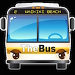

# &nbsp; [The Bus Honolulu](http://alexa.amazon.com/#skills/amzn1.echo-sdk-ams.app.d9ad7478-d8b3-4d06-bbe5-06e72c3037b3)
 0

To use the The Bus Honolulu skill, try saying...

* *Alexa, launch The Bus Honolulu*

* *Alexa, ask The Bus Honolulu when does the next bus arrive at 214*

* *Alexa, ask The Bus Honolulu get arrivals for stop 215*

This skill allows you to ask Alexa for arrivals scheduled for a provided bus stop in Hawaii.  You need to know your local bus stop number to use this skill at this time.  All arrivals scheduled for that bus stop will be announced and a card will be placed on your Alexa App for later reference.

***

### Skill Details

* **Invocation Name:** the bus honolulu
* **Category:** Travel
* **ID:** amzn1.echo-sdk-ams.app.d9ad7478-d8b3-4d06-bbe5-06e72c3037b3
* **ASIN:** B01EM86DL0
* **Author:** RGPS
* **Release Date:** April 26, 2016 @ 14:38:34
* **In-App Purchasing:** No
