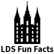

# &nbsp; [LDS Fun Facts](http://alexa.amazon.com/#skills/amzn1.echo-sdk-ams.app.958c8d41-a73f-4630-a8ad-26017659eeea)
 2

To use the LDS Fun Facts skill, try saying...

* *Alexa, ask church facts for a fact*

* *Alexa, ask church facts for an LDS fact*

* *Alexa, ask church facts for a fun fact*

Use Alexa to learn fun and interesting facts about the Church of Jesus Christ of Latter-day Saints (aka LDS or Mormon church) and it's members. Once you have enabled the skill, simply say "Alexa, ask church facts to tell me a fact" and she will do just that.

Impress your friends and family with your vast knowledge of obscure and interesting facts and trivia about The Church of Jesus Christ of Latter-day Saints.

***

### Skill Details

* **Invocation Name:** church facts
* **Category:** Entertainment
* **ID:** amzn1.echo-sdk-ams.app.958c8d41-a73f-4630-a8ad-26017659eeea
* **ASIN:** B01EMPJZE0
* **Author:** Rob Moncur
* **Release Date:** April 27, 2016 @ 07:38:39
* **In-App Purchasing:** No
