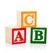

# &nbsp; [letters to word](http://alexa.amazon.com/#skills/amzn1.echo-sdk-ams.app.046c6159-2382-4074-9f28-3f695018ff56)
 1

To use the letters to word skill, try saying...

* *Alexa, start Letters to Word*

* *Give me a S*

* *What does that spell*

I made this program as a way to practice enunciating individual letters and also have fun spelling out words.  One letter at a time, tell Alexa what letters you want.  For example, "Give me a S." or simply, "a S."   She will remember them in the order you say them.  When you are done saying letters, Alexa will say the word you spelled out when you ask, "What does that spell?"  I hope you find this skill useful and have fun with it.

***

### Skill Details

* **Invocation Name:** letters to word
* **Category:** Games
* **ID:** amzn1.echo-sdk-ams.app.046c6159-2382-4074-9f28-3f695018ff56
* **ASIN:** B01EMTFKEU
* **Author:** midnight wrench
* **Release Date:** May 2, 2016 @ 03:08:28
* **In-App Purchasing:** No
