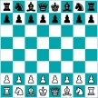

# &nbsp; [ChessOpeningHelper](http://alexa.amazon.com/#skills/amzn1.echo-sdk-ams.app.ddb141aa-5c06-4f84-a685-24dc2cd998d9)
 0

To use the ChessOpeningHelper skill, try saying...

* *Alexa, open Chess Opening Helper*

* *Alexa, launch Chess Opening Helper*

* *Alexa, start Chess Opening Helper*

Chess opening helper gives you the defining moves of the chess opening you want to learn about or need help remembering.  Great training tool for beginners and experts. Will be updated with more specific openings and variations.

***

### Skill Details

* **Invocation Name:** chess opening helper
* **Category:** null
* **ID:** amzn1.echo-sdk-ams.app.ddb141aa-5c06-4f84-a685-24dc2cd998d9
* **ASIN:** B01EO2Y05A
* **Author:** antblessing
* **Release Date:** May 12, 2016 @ 07:08:33
* **In-App Purchasing:** No
