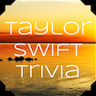

# &nbsp; [Trivia for Taylor Swift](http://alexa.amazon.com/#skills/amzn1.echo-sdk-ams.app.e7a04f23-1eab-4526-ac2f-2f8767841d05)
 0

To use the Trivia for Taylor Swift skill, try saying...

* *Alexa, launch trivia for taylor swift*

* *Repeat*

* *Help*

Think you can answer:
 "How old Taylor was When She Sang the National Anthem at the 76ers Game?"

This game can test your knowledge of Taylor Swift while having so much fun. Play individually or challenge a friend to see who can get a higher score.

***

### Skill Details

* **Invocation Name:** trivia for taylor swift
* **Category:** Games
* **ID:** amzn1.echo-sdk-ams.app.e7a04f23-1eab-4526-ac2f-2f8767841d05
* **ASIN:** B01EOCTG8Q
* **Author:** Marco Pizarro-Silva
* **Release Date:** April 27, 2016 @ 08:08:36
* **In-App Purchasing:** No
