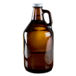

# &nbsp; [Growler Info](http://alexa.amazon.com/#skills/amzn1.echo-sdk-ams.app.d0322e06-866c-4f47-b5f2-94747dd034d3)
 0

To use the Growler Info skill, try saying...

* *Alexa, ask Growler for info*

* *Alexa, ask Growler how a growler is used*

* *Alexa, ask Growler about this skill*

Ask Growler for info and learn interesting, fun facts about beer growlers like how to properly clean. 

This skill may not be suitable for all ages. It discusses growlers which are used in the transport of alcoholic beverages.

***

### Skill Details

* **Invocation Name:** growler
* **Category:** Food/Cooking
* **ID:** amzn1.echo-sdk-ams.app.d0322e06-866c-4f47-b5f2-94747dd034d3
* **ASIN:** B01ERYBWLU
* **Author:** Daly-Apps.com
* **Release Date:** May 5, 2016 @ 02:08:29
* **In-App Purchasing:** No
