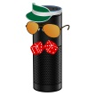

# &nbsp; [DiceBot](http://alexa.amazon.com/#skills/amzn1.echo-sdk-ams.app.3d097710-9c2c-44bc-9598-ad74699f07cb)
 0

To use the DiceBot skill, try saying...

* *Alexa, launch DiceBot*

* *Alexa, tell DiceBot to roll me five dice*

* *Alexa, ask DiceBot to roll 3 d 20 for me*

To quote Sophocles: "The dice of Zeus always fall luckily". He must've had DiceBot on his side.

**Note: This super secret description does not exist in DiceBot's help menu, so that nobody can inadvertently stumble upon DiceBot's cheating ways during conversation.

DiceBot listens for special patterns, and that's how it knows to switch out the fair dice with loaded dice.

To roll fair dice, just say something like "Roll three dice" or "roll a d20".

To roll dice that are weighted for higher numbers, replace "roll" with "roll me", as in "roll me three dice" or "roll me a d20".

Alternately, dice can be weighted downward by ending the sentence with "for me", for example "roll three dice for me" or "roll a d20 for me".

DiceBot's cheating is subtle - it shifts rolls on average by about 10% - and it's still possible to roll all values on a given die. Even with loaded d20, you still might roll a critical failure!

Further examples and instructions can be found at www.derpgroup.com/bots.html#2

***

### Skill Details

* **Invocation Name:** dice bot
* **Category:** null
* **ID:** amzn1.echo-sdk-ams.app.3d097710-9c2c-44bc-9598-ad74699f07cb
* **ASIN:** B01EUNE3W8
* **Author:** DERP Group
* **Release Date:** April 27, 2016 @ 15:38:33
* **In-App Purchasing:** No
