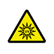

# &nbsp; [UV Meter](http://alexa.amazon.com/#skills/amzn1.echo-sdk-ams.app.b6f19c3c-eb87-443e-ac03-a77ea6f5bc6f)
 2

To use the UV Meter skill, try saying...

* *Alexa, ask UV Meter what is the UV index in Phoenix*

* *Alexa, ask UV Meter what sun protective Clothing will I need in Las Vegas*

* *Alexa, ask UV Meter to get UV index for Dallas*

Alexa will provide you real time UV index ratings for major cities. Check your city’s UV index here daily, and take the proper precautions to protect yourself and your family when you’re outdoors. 

Prolonged human exposure to solar UV radiation may result in acute and chronic health effects on the skin, eye and immune system. Within just five minutes on a sunny summer day your skin may absorb enough UV radiation to develop minor sunburns. In even less time, skin cells may suffer injury that you can neither see nor feel. Multiply it over years and the damage from daily sun exposure may become major, including skin cancer and sun-induced skin aging. This skill can advise you on the strength of the sun’s UV rays in your city.

There are six UV index ratings provided: Low, Moderate, High, Very High and Extreme. To begin, simply say "Alexa, open UV Meter". Then you can ask "What is the UV index in Phoenix?" or simply say the city name. For help, simply say "Help" or to quit this skill, simply say "Cancel".

***

### Skill Details

* **Invocation Name:** u. v. meter
* **Category:** null
* **ID:** amzn1.echo-sdk-ams.app.b6f19c3c-eb87-443e-ac03-a77ea6f5bc6f
* **ASIN:** B01EVRB37G
* **Author:** JAGGI
* **Release Date:** May 4, 2016 @ 10:08:40
* **In-App Purchasing:** No
