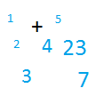

# &nbsp; [Mental Math](http://alexa.amazon.com/#skills/amzn1.echo-sdk-ams.app.745bb29f-70c2-4366-8c76-c3c04b454717)
 1

To use the Mental Math skill, try saying...

* *Alexa, start Mental Math*

* *The answer is 44*

* *My answer is 16*

Challenge yourself with some simple addition.

***

### Skill Details

* **Invocation Name:** mental math
* **Category:** Games
* **ID:** amzn1.echo-sdk-ams.app.745bb29f-70c2-4366-8c76-c3c04b454717
* **ASIN:** B01EYWNYLG
* **Author:** kg2s
* **Release Date:** May 3, 2016 @ 12:38:34
* **In-App Purchasing:** No
