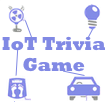

# &nbsp; [IoT Trivia Game](http://alexa.amazon.com/#skills/amzn1.echo-sdk-ams.app.450f63fa-ee49-4090-a9ca-45354bb22eb3)
 0

To use the IoT Trivia Game skill, try saying...

* *Alexa, start Internet of Things trivia*

* *Is it TWO?*

* *I don't know*

ZigBee, Z-wave, Wi-Fi, Insteon, SmartThings, MQTT, broker, sensor, actuator, hub, cloud - so many terms, so many "things", oh my! Test yourself to become the IoT wizard.

The IoT Trivia Game will ask you 5 questions about the Internet of Things, try to get as many right as you can. Just say the number of the answer you think is the right one. Good luck!

***

### Skill Details

* **Invocation Name:** internet of things trivia
* **Category:** null
* **ID:** amzn1.echo-sdk-ams.app.450f63fa-ee49-4090-a9ca-45354bb22eb3
* **ASIN:** B01F0FDL00
* **Author:** Ulanov Software
* **Release Date:** May 4, 2016 @ 09:38:40
* **In-App Purchasing:** No
