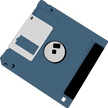

# &nbsp; [Computer Trivia](http://alexa.amazon.com/#skills/amzn1.echo-sdk-ams.app.1aa0d024-9f5a-47fd-9279-633cf07763b2)
 0

To use the Computer Trivia skill, try saying...

* *Alexa launch fizz buzz*

* *One*

* *Two*

The following skill will ask you a set of trivia questions related to the field of software development.  You will get a choice of four questions and you must choose the correct answer.  All questions are related to software development or computer history.

***

### Skill Details

* **Invocation Name:** fizz buzz
* **Category:** null
* **ID:** amzn1.echo-sdk-ams.app.1aa0d024-9f5a-47fd-9279-633cf07763b2
* **ASIN:** B01F6W1C8U
* **Author:** Rubix
* **Release Date:** May 6, 2016 @ 18:38:25
* **In-App Purchasing:** No
