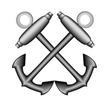

# &nbsp; [This Day in US Naval History](http://alexa.amazon.com/#skills/amzn1.echo-sdk-ams.app.b1e3d85a-12ad-4893-8c60-52bb403134a3)
 3

To use the This Day in US Naval History skill, try saying...

* *Alexa, Navy History*

* *Alexa, ask Navy History for Today.*

* *Alexa, tell Navy History to get Navy History for today*

In keeping with the heritage of the Navy this skill will let you know the significant events from US Naval history that occurred today.

***

### Skill Details

* **Invocation Name:** navy history
* **Category:** null
* **ID:** amzn1.echo-sdk-ams.app.b1e3d85a-12ad-4893-8c60-52bb403134a3
* **ASIN:** B01FG5FPF8
* **Author:** Frank Phillips
* **Release Date:** May 13, 2016 @ 10:08:36
* **In-App Purchasing:** No
