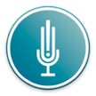

# &nbsp; [Focus Sceener](http://alexa.amazon.com/#skills/amzn1.echo-sdk-ams.app.e6d2cd7c-e86d-468f-9ba6-ea9765551a77)
 0

To use the Focus Sceener skill, try saying...

* *Alexa start  Focus screener*

* *Alexa begin  Focus screener*

* *Alexa   Focus screener*

The Symptom Checklist is an instrument consisting of the eighteen DSM-IV-TR criteria.  Six of the eighteen questions were found to be the most predictive of symptoms consistent with ADHD.  

If the user scores less than 10, he/she has a very low chance to be diagnosed with ADHD.

Between 10 and 14 he/she has a moderate chance to be diagnosed with ADHD.

A score of 15 and higher is considerate to have a very high chance to be diagnosed with ADHD.

DISCLAIMER : This is not a substitute for medical professional advice.

***

### Skill Details

* **Invocation Name:** focus screener
* **Category:** null
* **ID:** amzn1.echo-sdk-ams.app.e6d2cd7c-e86d-468f-9ba6-ea9765551a77
* **ASIN:** B01FL68TBY
* **Author:** Doctor Echo
* **Release Date:** May 20, 2016 @ 16:38:36
* **In-App Purchasing:** No
