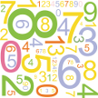

# &nbsp; [Number Fact](http://alexa.amazon.com/#skills/amzn1.echo-sdk-ams.app.329b862f-4744-4b88-9691-264847f47162)
 0

To use the Number Fact skill, try saying...

* *Alexa ask number fact 317*

* *Alexa ask number fact what makes 12 interesting*

* *Alexa ask number fact 411*

Ask Alexa to tell you something interesting about a number and be amazed at the result.

***

### Skill Details

* **Invocation Name:** number fact
* **Category:** Entertainment
* **ID:** amzn1.echo-sdk-ams.app.329b862f-4744-4b88-9691-264847f47162
* **ASIN:** B01FNFK5Z6
* **Author:** BLT Robotics
* **Release Date:** May 20, 2016 @ 01:08:34
* **In-App Purchasing:** No
