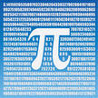

# &nbsp; [Math Trivia](http://alexa.amazon.com/#skills/amzn1.echo-sdk-ams.app.77f482f1-1da5-4ad1-8e35-989d5faf5cc4)
 0

To use the Math Trivia skill, try saying...

* *Alexa, open math trivia*

* *new game*

* *I don't know*

The Math History Trivia skill is the most fun you'll ever have with math! This skill will ask you questions that challenge you to think about math in an all new light that you never had! Questions include where does algebra originate, who founded calculus, and more! You will get to enjoy challenging yourself with your own knowledge of mathematical vocabulary and historic knowledge.

***

### Skill Details

* **Invocation Name:** math trivia
* **Category:** Education
* **ID:** amzn1.echo-sdk-ams.app.77f482f1-1da5-4ad1-8e35-989d5faf5cc4
* **ASIN:** B01FNR507W
* **Author:** KurtPrice
* **Release Date:** May 19, 2016 @ 07:08:34
* **In-App Purchasing:** No
