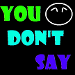

# &nbsp; [You Don't Say](http://alexa.amazon.com/#skills/amzn1.echo-sdk-ams.app.ab49be64-99f3-45cd-ad47-b820695fa6fe)
 0

To use the You Don't Say skill, try saying...

* *Alexa, launch you don't say*

* *help*

* *Alexa, open you don't say*

Want to have some fun? Do you want to know more about facts that you wouldn't think someone would tell you? Ask Alexa for facts that might make you laugh.

There is no guarantee you will learn anything from this.

***

### Skill Details

* **Invocation Name:** you don't say
* **Category:** null
* **ID:** amzn1.echo-sdk-ams.app.ab49be64-99f3-45cd-ad47-b820695fa6fe
* **ASIN:** B01FO63PMY
* **Author:** Chinh
* **Release Date:** May 21, 2016 @ 01:38:36
* **In-App Purchasing:** No
