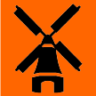

# &nbsp; [Netherlands Trivia](http://alexa.amazon.com/#skills/amzn1.echo-sdk-ams.app.e5be97a0-edc3-42c9-b2be-0896bfc1d07a)
 0

To use the Netherlands Trivia skill, try saying...

* *Alexa, Open Netherlands Trivia*

* *Repeat*

* *Help*

Test your knowledge of the Netherlands, its major attractions, cities, and history.  Answer multiple choice questions about the country and either confirm your knowledge or learn something new!

***

### Skill Details

* **Invocation Name:** netherlands trivia
* **Category:** Education
* **ID:** amzn1.echo-sdk-ams.app.e5be97a0-edc3-42c9-b2be-0896bfc1d07a
* **ASIN:** B01FOQYH62
* **Author:** Ben Plantinga
* **Release Date:** May 16, 2016 @ 14:08:34
* **In-App Purchasing:** No
