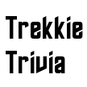

# &nbsp; [Trekkie Trivia](http://alexa.amazon.com/#skills/amzn1.echo-sdk-ams.app.bd7be3da-ed27-453f-aa24-9f3b7bedec2e)
 0

To use the Trekkie Trivia skill, try saying...

* *Alexa Start Trekkie Trivia*

* *One*

* *I Don't know*

Trivia for Trekkie's.  Test your Knowledge of the Star Trek universe!  The trivia game covers all of the TV series, with new questions added periodically.

***

### Skill Details

* **Invocation Name:** trekkie trivia
* **Category:** Entertainment
* **ID:** amzn1.echo-sdk-ams.app.bd7be3da-ed27-453f-aa24-9f3b7bedec2e
* **ASIN:** B01FRG1JSS
* **Author:** Joe Reese
* **Release Date:** May 20, 2016 @ 04:08:40
* **In-App Purchasing:** No
