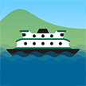

# &nbsp; [Washington State Ferry](http://alexa.amazon.com/#skills/amzn1.echo-sdk-ams.app.c9b66172-8af5-46d1-b243-89a358beb229)
 1

To use the Washington State Ferry skill, try saying...

* *Alexa, ask Washington State Ferry when is the next ferry from Seattle to Bainbridge.*

* *How much space is available on the next ferry from Seattle to Bainbridge?*

* *When is the last ferry from Anacortes to Friday Harbor tomorrow?*

Don't miss the boat! Get the next departure times for any route in the Washington State Ferry system. If you can't make it, ask for the ferry after that. You can also get information about remaining spaces, and the last scheduled ferry for the day. You can always say "Help" to find out more about what Washington State Ferry can do or "Goodbye" to end a session.

***

### Skill Details

* **Invocation Name:** washington state ferry
* **Category:** null
* **ID:** amzn1.echo-sdk-ams.app.c9b66172-8af5-46d1-b243-89a358beb229
* **ASIN:** B01FROAWB0
* **Author:** Blink UX
* **Release Date:** May 26, 2016 @ 09:08:44
* **In-App Purchasing:** No
