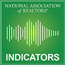

# &nbsp; [Indicators](http://alexa.amazon.com/#skills/amzn1.echo-sdk-ams.app.2eb650d7-cc8f-47c6-9f8b-843e479b64bd)
 2

To use the Indicators skill, try saying...

* *Alexa, ask Economic Indicators what is the value of Gross Domestic Product*

* *Alexa, ask Economic Indicators what is the Civilian Unemployment Rate*

* *Alexa, ask Economic Indicators what is the value of Existing Home Sales*

Economies around the world change in an instant. As such, it can be difficult to follow global economic conditions. However, with Indicators you can quickly and easily keep up with the state of the economy. We support tens of thousands of data series, including GDP, the Unemployment Rate, Median Household Income, Existing Home Sales, and the Federal Funds Rate.

***

### Skill Details

* **Invocation Name:** economic indicators
* **Category:** null
* **ID:** amzn1.echo-sdk-ams.app.2eb650d7-cc8f-47c6-9f8b-843e479b64bd
* **ASIN:** B01FUNSD32
* **Author:** National Association of REALTORS
* **Release Date:** May 27, 2016 @ 03:38:47
* **In-App Purchasing:** No
