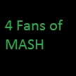

# &nbsp; [FansOfMASH](http://alexa.amazon.com/#skills/amzn1.echo-sdk-ams.app.24a6f2e7-9642-46c1-bc3d-4ef4a3ed5954)
 0

To use the FansOfMASH skill, try saying...

* *Alexa open fans of mash*

* *Alexa ask fans of mash to tell me a mash fact*

* *Alexa ask fans of mash to give me a mash fact*

This skill will give you a bunch of interesting facts I found out about the hit TV show MASH. Lots of interesting things I bet you never knew about the TV series.

Please note this skill is not created by or endorsed by anyone involved with MASH. This is just created by a fan with too much time on his hands.

***

### Skill Details

* **Invocation Name:** fans of mash
* **Category:** null
* **ID:** amzn1.echo-sdk-ams.app.24a6f2e7-9642-46c1-bc3d-4ef4a3ed5954
* **ASIN:** B01FZGIDG6
* **Author:** Trex3000
* **Release Date:** June 9, 2016 @ 05:39:49
* **In-App Purchasing:** No
