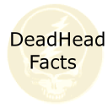

# &nbsp; [Deadhead Facts](http://alexa.amazon.com/#skills/amzn1.echo-sdk-ams.app.23ea40eb-00cd-498c-a993-9f05b6a39719)
 0

To use the Deadhead Facts skill, try saying...

* *Alexa, Open Deadhead Facts*

* *Alexa, Ask Deadhead Facts for a fact*

* *Alexa, Start Deadhead Facts*

Trivia facts for Deadheads, fans of the greatest rock group of all time, The Grateful Dead.  Find out some interesting things you didn't know about the dead.  It will be updated periodically with new facts.

***

### Skill Details

* **Invocation Name:** deadhead facts
* **Category:** Entertainment
* **ID:** amzn1.echo-sdk-ams.app.23ea40eb-00cd-498c-a993-9f05b6a39719
* **ASIN:** B01FZWQLEG
* **Author:** TLE Creations
* **Release Date:** May 24, 2016 @ 03:38:34
* **In-App Purchasing:** No
