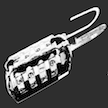

# &nbsp; [CodeBreaker](http://alexa.amazon.com/#skills/amzn1.echo-sdk-ams.app.e00705b8-73c0-44fe-8e93-8fd65dea8968)
 0

To use the CodeBreaker skill, try saying...

* *Alexa ask CodeBreaker to start a new game*

* *one two three four*

* *done*

CodeBreaker is a game that tests your analytical skill. It is based on a century old game played with paper and pen. Goal is to guess a 4 digit number.

- Alexa generates a 4 digit number
- You say a four digit number
- Alexa responds with Black, White or No Match for each digit

Black - correct position
White - incorrect position
No Match - digit does not exist in the code

This is the basic mode of the game. Intermediate and Advanced modes to be released soon.

***

### Skill Details

* **Invocation Name:** code breaker
* **Category:** Games
* **ID:** amzn1.echo-sdk-ams.app.e00705b8-73c0-44fe-8e93-8fd65dea8968
* **ASIN:** B01G0XQKYK
* **Author:** Quasar Solutions LLC
* **Release Date:** June 9, 2016 @ 08:09:36
* **In-App Purchasing:** No
