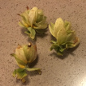

# &nbsp; [Hopstand](http://alexa.amazon.com/#skills/amzn1.echo-sdk-ams.app.5c89c34c-5dc7-4287-a116-9b080d523c0a)
 0

To use the Hopstand skill, try saying...

* *Alexa, ask hop stand to convert 14 point 6 brix*

* *Estimate the abv of 14 point 6 brix*

* *What is the OG of 14 point 6 brix*

Note: This skill relates to the brewing of alcoholic beverages and may not be suitable for all ages.

This skill allows you to quickly convert refractometer readings to specific gravity points and estimate ABV of finished beers.

This app responds to the name "hopstand". To interact, say "Alexa, ask Hopstand to..." followed by your command. Example: "Alexa, Ask Hopstand to convert 14.6 brix to specific gravity"

Currently, this app can convert refractometer readings to Original Gravity, and estimate ABV from original gravity.

***

### Skill Details

* **Invocation Name:** hop stand
* **Category:** null
* **ID:** amzn1.echo-sdk-ams.app.5c89c34c-5dc7-4287-a116-9b080d523c0a
* **ASIN:** B01G1AJ5JE
* **Author:** Optictheory
* **Release Date:** June 1, 2016 @ 01:08:37
* **Terms of Use:** https://alexa.optictheory.com/display_terms/
* **In-App Purchasing:** No
