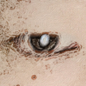

# &nbsp; [ThreeEyedRaven](http://alexa.amazon.com/#skills/amzn1.echo-sdk-ams.app.1d30b0c5-c10d-4eab-aca8-856cd817f24b)
 2

To use the ThreeEyedRaven skill, try saying...

* *Alexa, ask Three Eyed Raven what the words of House Stark are.*

* *Alexa, ask Three Eyed Raven to give me the words of House Baratheon.*

* *Alexa, ask Three Eyed Raven what are the words of House Martell?*

Tell Alexa to ask Three Eyed Raven about the words of a House in the Seven Kingdoms. If the information is known, it will be conveyed to you.

***

### Skill Details

* **Invocation Name:** three eyed raven
* **Category:** null
* **ID:** amzn1.echo-sdk-ams.app.1d30b0c5-c10d-4eab-aca8-856cd817f24b
* **ASIN:** B01G37FVRU
* **Author:** Jonathan Luo
* **Release Date:** May 27, 2016 @ 00:08:34
* **In-App Purchasing:** No
