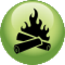

# &nbsp; [Clean Air](http://alexa.amazon.com/#skills/amzn1.echo-sdk-ams.app.4c2340d8-b3c8-4101-a1c9-f6736cbba810)
 0

To use the Clean Air skill, try saying...

* *Alexa, ask clean air, can we burn today*

* *Alexa, ask clean air, can we burn wood today*

* *Alexa, ask clean air, can we have a fire*

Checks the Maricopa County web site, CleanAirMakeMore.com, to determine if it is OK to burn wood.

"Clean Air Make More is an educational outreach initiative created to inform Maricopa County residents about air pollution challenges we face in the county and provide them with the tools they need to take action."

***

### Skill Details

* **Invocation Name:** clean air
* **Category:** Utilities
* **ID:** amzn1.echo-sdk-ams.app.4c2340d8-b3c8-4101-a1c9-f6736cbba810
* **ASIN:** B01G4JC3WS
* **Author:** Sonoran Software Services, llc
* **Release Date:** June 13, 2016 @ 08:39:38
* **In-App Purchasing:** No
