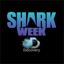

# &nbsp; [Discovery Channel's Shark Week](http://alexa.amazon.com/#skills/amzn1.echo-sdk-ams.app.d92afb13-c427-4a20-9b31-6ec68fc940b1)
 0

To use the Discovery Channel's Shark Week skill, try saying...

* *Alexa, ask shark week for a fact.*

* *Alexa, ask shark week when shark week starts.*

* *Alexa, ask shark week when shark week begins.*

The longest-running cable television programming event in history, Discovery Channel's #SharkWeek returns early this year, Sunday June 26th at 8/7c! Ask Alexa for shark facts, a countdown for when shark week begins, and more! Visit www.SharkWeek.com for more info.

***

### Skill Details

* **Invocation Name:** shark week
* **Category:** Entertainment
* **ID:** amzn1.echo-sdk-ams.app.d92afb13-c427-4a20-9b31-6ec68fc940b1
* **ASIN:** B01G5VHY2O
* **Author:** Discovery Communications
* **Release Date:** June 6, 2016 @ 15:38:30
* **Privacy Policy:** https://corporate.discovery.com/privacy-policy/
* **Terms of Use:** https://corporate.discovery.com/visitor-agreement/
* **In-App Purchasing:** No
