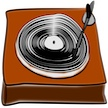

# &nbsp; [Record of the Year](http://alexa.amazon.com/#skills/amzn1.echo-sdk-ams.app.1156f02c-50bc-4cb2-95fb-38c454e17dc9)
 1

To use the Record of the Year skill, try saying...

* *Alexa, ask record of the year what was the record of the year in 1988*

* *Alexa, ask record of the year who won record of the year in 1993*

* *Alexa, ask record of the year record of the year 2015*

Flashback to the greatest hits of today and the past decades with Record of the Year! Use this skill to find who won the Grammy for record of the year from 1959 to 2015. Reminisce about your favorite songs in the present and past!

Here is an example for using this skill:
Alexa, ask record of the year what was the record of the year in 1988

***

### Skill Details

* **Invocation Name:** record of the year
* **Category:** Entertainment
* **ID:** amzn1.echo-sdk-ams.app.1156f02c-50bc-4cb2-95fb-38c454e17dc9
* **ASIN:** B01G6BGGBI
* **Author:** Team Luna
* **Release Date:** May 26, 2016 @ 09:38:39
* **In-App Purchasing:** No
