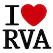

# &nbsp; [Richmond Virginia Facts](http://alexa.amazon.com/#skills/amzn1.echo-sdk-ams.app.f95135b0-f6b3-455f-bece-a420496677f7)
 2

To use the Richmond Virginia Facts skill, try saying...

* *Alexa, open RVA Facts*

* *Alexa, launch RVA Facts*

* *Alexa, start RVA Facts*

Richmond is the Southern capital of cool. Already well known for its rich history, Richmond is now emerging as a hip destination.  A flourishing craft-beer scene and a flurry of new restaurants reflect the creativity found in Virginia's soulful Southern city. 

"Alexa, open RVA Facts" to learn some interesting facts about Richmond, the Southern capital of cool.

***

### Skill Details

* **Invocation Name:** r. v. a. facts
* **Category:** null
* **ID:** amzn1.echo-sdk-ams.app.f95135b0-f6b3-455f-bece-a420496677f7
* **ASIN:** B01GAJQKF8
* **Author:** Drew Firment
* **Release Date:** June 1, 2016 @ 01:08:39
* **In-App Purchasing:** No
