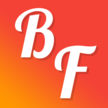

# &nbsp; [Best Friend](http://alexa.amazon.com/#skills/amzn1.echo-sdk-ams.app.2d03cd5f-b82b-4c92-a436-07c9b06093da)
 0

To use the Best Friend skill, try saying...

* *Alexa ask Best Friend to tell me a fact.*

* *Alexa ask Best Friend to give me a fact.*

* *Alexa ask Best Friend why shouldn't I underage drink.*

Best Friend provides you 101 reasons not to underage drink. Best Friend is your digital best friend to persuade you not to make a foolish decision that could impact the rest of your life.

This Alexa Skill was created by the Youth Coalition for Alcohol Education, a student group in Lexington KY. We educate youth and adults on the risks involved in underage drinking through presentations to both adults and teens, television appearances, radio spots, and special projects.

***

### Skill Details

* **Invocation Name:** best friend
* **Category:** Education
* **ID:** amzn1.echo-sdk-ams.app.2d03cd5f-b82b-4c92-a436-07c9b06093da
* **ASIN:** B01GCA3IZU
* **Author:** Untamed Entertainment
* **Release Date:** June 1, 2016 @ 06:38:35
* **In-App Purchasing:** No
