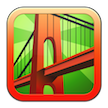

# &nbsp; [San Francisco Facts](http://alexa.amazon.com/#skills/amzn1.echo-sdk-ams.app.59a9a6d7-ccd8-4d28-b0a9-3a3cd74838b0)
 1

To use the San Francisco Facts skill, try saying...

* *Alexa, ask San Francisco to tell me something.*

* *Alexa, ask San Francisco to tell me a fact.*

* *Alexa, ask San Francisco for a fact.*

Alexa tells you things you didn't know about San Francisco.

***

### Skill Details

* **Invocation Name:** san francisco
* **Category:** null
* **ID:** amzn1.echo-sdk-ams.app.59a9a6d7-ccd8-4d28-b0a9-3a3cd74838b0
* **ASIN:** B01GEW3J5A
* **Author:** Office Grooves
* **Release Date:** June 1, 2016 @ 06:38:39
* **In-App Purchasing:** No
