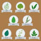

# &nbsp; [Herb Guide](http://alexa.amazon.com/#skills/amzn1.echo-sdk-ams.app.942fd367-9af3-4ab0-86ed-ce8bacfbcb57)
 2

To use the Herb Guide skill, try saying...

* *alexa ask  herb guide to tell about ginger*

* *alexa ask herb guide to give me something about ginger*

* *alexa open herb guide*

This alexa skill helps alexa users learn about multiple herbs. Users say "alexa ask herb guide to tell about ginger" and alexa speaks about nutrition facts about ginger.

***

### Skill Details

* **Invocation Name:** herb guide
* **Category:** null
* **ID:** amzn1.echo-sdk-ams.app.942fd367-9af3-4ab0-86ed-ce8bacfbcb57
* **ASIN:** B01GNNQU1A
* **Author:** sainath
* **Release Date:** June 13, 2016 @ 06:39:35
* **In-App Purchasing:** No
