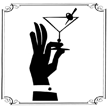

# &nbsp; [Happy Hour](http://alexa.amazon.com/#skills/amzn1.echo-sdk-ams.app.63c00ef6-cb22-4033-9fda-41626cae2646)
 0

To use the Happy Hour skill, try saying...

* *Alexa, ask the Bar Maid what's in a margarita.*

* *Alexa, ask the Bar Maid to list the scotch drinks*

* *Alexa, ask the Bar Maid to send an instruction card.*

This skill will give recipes for over 170 popular bar drinks.  The drink list includes all of the standard fare plus others like Sidecar, Singapore Sling, Sex on the Beach, Apple Martini, Blue Kamikaze, and more.

The Bar Maid can be asked for specific drink recipes, types of drinks, and recipes for a specific type of alcohol.

Invoke this skill by saying, with some variations allowed for 'a' and 'an': 

"Alexa, ask the Bar Maid how can I make an apple martini”
"Alexa, ask the Bar Maid how does one make a scorpion”
"Alexa, ask the Bar Maid how can you make a 57 chevy”
"Alexa, ask the Bar Maid how do I make a godfather”
"Alexa, ask the Bar Maid how do you make a sea breeze”
"Alexa, ask the Bar Maid how is a blaster made”
"Alexa, ask the Bar Maid how an adios is made”
"Alexa, ask the Bar Maid recipe for a side car”
"Alexa, ask the Bar Maid what are the ingredients for a blaster”
"Alexa, ask the Bar Maid what do I need for a fuzzy navel”
"Alexa, ask the Bar Maid what do I need for an oatmeal cookie”
"Alexa, ask the Bar Maid what do I need to get for a manhattan”
"Alexa, ask the Bar Maid what do I need to get to make a mai tai”
"Alexa, ask the Bar Maid what do I need to have to make an old fashioned”
"Alexa, ask the Bar Maid what do I need to make a frozen daquiri”
"Alexa, ask the Bar Maid what do you need for a screwdriver”
"Alexa, ask the Bar Maid what ingredients do I need to make a barryetto”
"Alexa, ask the Bar Maid what ingredients are in an bahama mama”
"Alexa, ask the Bar Maid what is in a chocolate cake”
"Alexa, ask the Bar Maid what is the recipe for a cadillac margarita”
"Alexa, ask the Bar Maid what's in a purple hooter”
"Alexa, ask the Bar Maid what's the recipe for a purple haze”
"Alexa, ask the Bar Maid how to make a black russian”
"Alexa, ask the Bar Maid what kind of rum recipes do you have”
"Alexa, ask the Bar Maid what kind of whiskey recipes are available”
"Alexa, ask the Bar Maid what kind of vodka drinks do you have”
"Alexa, ask the Bar Maid to name the brandy drinks available”
"Alexa, ask Bar the Maid to name the bourbon drinks”
"Alexa, ask the Bar Maid to list the rum recipes”
"Alexa, ask the Bar Maid to list the brandy recipes you have”
"Alexa, ask the Bar Maid to list the whiskey drinks you have”
"Alexa, ask the Bar Maid to list the bourbon drinks available”
"Alexa, ask the Bar Maid to list the brandy recipes you have”
"Alexa, ask the Bar Maid to list the whiskey drinks you have”
"Alexa, ask the Bar Maid to list the bourbon drinks available”
"Alexa, ask the Bar Maid what types of drinks can you make”
"Alexa, ask the Bar Maid what are the types of drinks you have available”
"Alexa, ask the Bar Maid what types of drinks you have”
"Alexa, ask the Bar Maid what types of drinks do you have”
"Alexa, ask the Bar Maid what types of drinks do you have on file”
"Alexa, ask the Bar Maid what type of drink recipes do you have”
"Alexa, ask the Bar Maid to name the type of drink recipes you have”
"Alexa, ask the Bar Maid to name the types of drink recipes she has”
"Alexa, ask the Bar Maid name the types of drink recipes”
“Alexa, ask the Bar Maid what drink types start with the letter a”
“Alexa, ask the Bar Maid what drink types she has starting with the letter a”
“Alexa, ask the Bar Maid what drink types start with the letter a”
“Alexa, ask the Bar Maid for drink types starting with the letter a”
"Alexa, ask the Bar Maid to list the drink types starting with the letter a"

"Alexa ask the Bar Maid for help"
"stop"
"cancel"

Note: This skill is not intended for use by anyone not legally old enough to enjoy alcoholic beverages and will be periodically refined and updated.

***

### Skill Details

* **Invocation Name:** the bar maid
* **Category:** null
* **ID:** amzn1.echo-sdk-ams.app.63c00ef6-cb22-4033-9fda-41626cae2646
* **ASIN:** B01GQSHD18
* **Author:** Peacock Cove, LLC
* **Release Date:** June 16, 2016 @ 02:45:35
* **In-App Purchasing:** No
