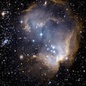

# &nbsp; [Cosmic Explosion](http://alexa.amazon.com/#skills/amzn1.echo-sdk-ams.app.73091661-da06-44c8-bfac-2ee89b9b83ca)
 0

To use the Cosmic Explosion skill, try saying...

* *Alexa, launch Cosmic Explosion*

* *Alexa, open Cosmic Explosion and tell me a fact*

* *Alexa, start Cosmic Explosion and give me a fact*

The universe is much larger than you can possibly ever imagine. Alexa will spit out a random fact about the cosmos like a comet from outer space.

***

### Skill Details

* **Invocation Name:** cosmic explosion
* **Category:** null
* **ID:** amzn1.echo-sdk-ams.app.73091661-da06-44c8-bfac-2ee89b9b83ca
* **ASIN:** B01GUG0DOU
* **Author:** mehtaculous
* **Release Date:** June 10, 2016 @ 07:09:38
* **In-App Purchasing:** No
