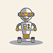

# &nbsp; [BeerBot](http://alexa.amazon.com/#skills/amzn1.echo-sdk-ams.app.29fe285e-4e07-4a3e-9f08-4ef63a4d1512)
 0

To use the BeerBot skill, try saying...

* *Alexa ask beer bot*

* *help me find a beer*

* *what beers are on sale*

This skill uses BeerBot to answer any questions about beer. This skill may not be suitable for all ages as it contains information about alcohol.

***

### Skill Details

* **Invocation Name:** beer bot
* **Category:** null
* **ID:** amzn1.echo-sdk-ams.app.29fe285e-4e07-4a3e-9f08-4ef63a4d1512
* **ASIN:** B01H5ZVS3U
* **Author:** Dylan Chiu
* **Release Date:** June 28, 2016 @ 07:46:00
* **Privacy Policy:** http://deeppixelmvp.appspot.com/privacy-policy-and-terms-of-use.html
* **Terms of Use:** http://deeppixelmvp.appspot.com/privacy-policy-and-terms-of-use.html
* **In-App Purchasing:** No
