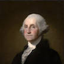

# &nbsp; [U.S. Presidential Trivia](http://alexa.amazon.com/#skills/amzn1.echo-sdk-ams.app.e27b1fa6-348c-49ce-94d4-49ac7ab4f674)
 0

To use the U.S. Presidential Trivia skill, try saying...

* *"Alexa, open Presidential Trivia."*

* *"The answer is four."*

* *"I don't know that one."*

With this skill, Alexa will ask you a randomly-generated trivia question about U.S. Presidents. To get started, just say, "Alexa, open Presidential Trivia"

***

### Skill Details

* **Invocation Name:** presidential trivia
* **Category:** null
* **ID:** amzn1.echo-sdk-ams.app.e27b1fa6-348c-49ce-94d4-49ac7ab4f674
* **ASIN:** B01H9G0R4Q
* **Author:** Jake Bell
* **Release Date:** July 5, 2016 @ 04:27:36
* **In-App Purchasing:** No
