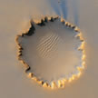

# &nbsp; [Mars Facts Skill](http://alexa.amazon.com/#skills/amzn1.echo-sdk-ams.app.d0eeeed7-1cfe-4baa-8e4c-736b9888a778)
 0

To use the Mars Facts Skill skill, try saying...

* *Alexa, Mars Fact*

* *Alexa ask Mars Fact to tell me a Mars trivia*

* *Alexa ask Mars Fact to tell me a fact*

Facts and figures about the the fourth planet t from the Sun, the planet Mars.

***

### Skill Details

* **Invocation Name:** mars fact
* **Category:** null
* **ID:** amzn1.echo-sdk-ams.app.d0eeeed7-1cfe-4baa-8e4c-736b9888a778
* **ASIN:** B01H9RQOPQ
* **Author:** ConnorsFour
* **Release Date:** June 22, 2016 @ 08:16:03
* **In-App Purchasing:** No
