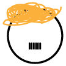

# &nbsp; [Which Demagogue](http://alexa.amazon.com/#skills/amzn1.echo-sdk-ams.app.ab6dd4a1-4593-41a3-9f11-fc2bcfbe23fb)
 0

To use the Which Demagogue skill, try saying...

* *Alexa, ask Which Demagogue to start new game.*

* *Is it Trump?*

* *My answer is Hitler.*

Test your history and identify the source of a given quote - either Donald Trump or Adolf Hitler.

***

### Skill Details

* **Invocation Name:** which demagogue
* **Category:** null
* **ID:** amzn1.echo-sdk-ams.app.ab6dd4a1-4593-41a3-9f11-fc2bcfbe23fb
* **ASIN:** B01HAQKYWA
* **Author:** Greg Stromire
* **Release Date:** June 29, 2016 @ 05:59:37
* **In-App Purchasing:** No
