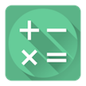

# &nbsp; [My Calculator](http://alexa.amazon.com/#skills/amzn1.echo-sdk-ams.app.10f09e5b-99f8-4812-9ebe-2b817f5ce01f)
 2

To use the My Calculator skill, try saying...

* *Alexa, ask My Calculator to add five and seven.*

* *Alexa, ask My Calculator to raise two to the power of three.*

* *Alexa, ask My Calculator to take the square root of nine.*

My Calculator can currently help you with basic calculations including addition, subtraction, multiplication, division, powers and square roots. Just ask Alexa one of the sample phrases above and she will do the calculation for you. Note that currently, My Calculator cannot work with ordinals, decimals or fractions. 

Features coming very soon:
- Understanding of ordinals, decimals and fractions
- Greatest common divisor
- Smallest common multiple
- Storing values for later use
- Many others, so stay tuned!

***

### Skill Details

* **Invocation Name:** my calculator
* **Category:** null
* **ID:** amzn1.echo-sdk-ams.app.10f09e5b-99f8-4812-9ebe-2b817f5ce01f
* **ASIN:** B01HBWI4B6
* **Author:** Jens
* **Release Date:** June 25, 2016 @ 03:16:24
* **In-App Purchasing:** No
