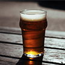

# &nbsp; [BeerGeek](http://alexa.amazon.com/#skills/amzn1.echo-sdk-ams.app.ea329828-8000-45a9-a388-47105c60809b)
 1

To use the BeerGeek skill, try saying...

* *Alexa ask beer geek*

* *Alexa, ask beer geek to tell me some beer trivia*

* *Alexa, ask beer geek to tell me a beer fact*

An Alexa skill designed to inform you more about beer. From the brewing process, it's history, the ingredients used, and some fun trivia.

DISCLAIMER: This skill is for users 21 years or older as it pertains to alcohol.

No additional requirements, accounts, or accessories needed to use the skill

***

### Skill Details

* **Invocation Name:** beer geek
* **Category:** null
* **ID:** amzn1.echo-sdk-ams.app.ea329828-8000-45a9-a388-47105c60809b
* **ASIN:** B01HC5A744
* **Author:** Tyler Schmidt
* **Release Date:** June 28, 2016 @ 05:45:35
* **In-App Purchasing:** No
