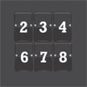

# &nbsp; [Number Counter](http://alexa.amazon.com/#skills/amzn1.echo-sdk-ams.app.40208bde-9a3a-4d7f-8506-9ad676cfc3d3)
 1

To use the Number Counter skill, try saying...

* *Alexa, ask Number Counter to count to one hundred.*

* *Alexa, ask Number Counter to count by five to one hundred.*

* *Alexa, launch Number Counter.*

Number counter will count up to a certain number, or count to a certain number by a certain increment. 

For example, you can say, "Alexa, ask Number Counter to count to one hundred." In response Alexa will count from one to one hundred.

You can also say, "Alexa, ask Number Counter to count by seven to four hundred." In response, Alexa will count by sevens to four hundred (7, 14, 21, 28 ...).

You can ask for numbers or increments into the millions, and receive up to one thousand different numbers in response to a request.

***

### Skill Details

* **Invocation Name:** number counter
* **Category:** null
* **ID:** amzn1.echo-sdk-ams.app.40208bde-9a3a-4d7f-8506-9ad676cfc3d3
* **ASIN:** B01HDPQIXW
* **Author:** worldengine
* **Release Date:** June 22, 2016 @ 09:47:01
* **In-App Purchasing:** No
