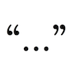

# &nbsp; [Conversation Starters](http://alexa.amazon.com/#skills/amzn1.echo-sdk-ams.app.b904c157-46ad-4ddf-879a-fe60def657ca)
 0

To use the Conversation Starters skill, try saying...

* *Alexa, start a new conversation*

Starting this skill returns a random choice out of a large collection of handpicked conversation starters.

***

### Skill Details

* **Invocation Name:** a new conversation
* **Category:** null
* **ID:** amzn1.echo-sdk-ams.app.b904c157-46ad-4ddf-879a-fe60def657ca
* **ASIN:** B01HEAE87Y
* **Author:** Timothy Aaron
* **Release Date:** June 29, 2016 @ 06:57:42
* **In-App Purchasing:** No
