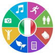

# &nbsp; [Learn Italian](http://alexa.amazon.com/#skills/amzn1.echo-sdk-ams.app.f498d7fa-a486-4f14-9526-02afd196b3b6)
 1

To use the Learn Italian skill, try saying...

* *Alexa, learn Italian*

* *Alexa, ask learn Italian for Italian lessons*

* *Alexa, ask learn Italian to tell me something in Italian*

You can learn the most commonly used phrases in Italian with Alexa. Simply ask Alexa to "learn Italian", or "Italian lessons". You can ask her to repeat as well if you didn't hear a certain sentence.

***

### Skill Details

* **Invocation Name:** learn italian
* **Category:** null
* **ID:** amzn1.echo-sdk-ams.app.f498d7fa-a486-4f14-9526-02afd196b3b6
* **ASIN:** B01HG6MYRC
* **Author:** ALPHABETO
* **Release Date:** June 29, 2016 @ 05:58:34
* **In-App Purchasing:** No
