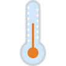

# &nbsp; [TheTemperatureInside](http://alexa.amazon.com/#skills/amzn1.echo-sdk-ams.app.ae4d371c-43f0-4a82-ae7b-622effae08aa)
 2

To use the TheTemperatureInside skill, try saying...

* *Alexa, tell the temperature inside the point of sale number five*

* *Alexa, ask the temperature inside*

* *Alexa, launch the temperature inside*

This is a simple skill to allow you to ask Alexa to tell the temperature inside point of sale. The goal of this skill is to give you knowledge of the current value of the temperature in degrees Celsius of your location

***

### Skill Details

* **Invocation Name:** the temperature inside
* **Category:** null
* **ID:** amzn1.echo-sdk-ams.app.ae4d371c-43f0-4a82-ae7b-622effae08aa
* **ASIN:** B01HJ0BX2C
* **Author:** GSGTech
* **Release Date:** June 28, 2016 @ 06:45:41
* **In-App Purchasing:** No
