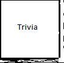

# &nbsp; [MyTriviaGame](http://alexa.amazon.com/#skills/amzn1.echo-sdk-ams.app.05ccfe74-7e78-45e5-a764-ea087fc106fd)
 0

To use the MyTriviaGame skill, try saying...

* *Alexa, start trivia game.*

* *my answer is two*

* *is it three*

trivia game based on Amazon Alexa skill tutorial. Features trivia questions found throughout the internet.

***

### Skill Details

* **Invocation Name:** trivia game
* **Category:** null
* **ID:** amzn1.echo-sdk-ams.app.05ccfe74-7e78-45e5-a764-ea087fc106fd
* **ASIN:** B01HKESBT0
* **Author:** Scott Guyton
* **Release Date:** July 1, 2016 @ 04:27:31
* **In-App Purchasing:** No
