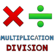

# &nbsp; [Learn Simple Multiplication and Division](http://alexa.amazon.com/#skills/amzn1.echo-sdk-ams.app.f04b89a2-df7e-401b-a7b2-75ca086920e8)
 0

To use the Learn Simple Multiplication and Division skill, try saying...

* *Alexa open simple multiplication division*

* *new game*

* *the answer is eight*

The skills learned will help with solving basic multiplication and division

***

### Skill Details

* **Invocation Name:** simple multiplication division
* **Category:** null
* **ID:** amzn1.echo-sdk-ams.app.f04b89a2-df7e-401b-a7b2-75ca086920e8
* **ASIN:** B01HM2XN84
* **Author:** AndrewHickey
* **Release Date:** July 14, 2016 @ 08:27:46
* **In-App Purchasing:** No
