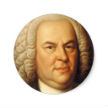

# &nbsp; [Great Composer Quiz](http://alexa.amazon.com/#skills/amzn1.echo-sdk-ams.app.a147d962-8d6b-4f8b-a251-12448225d90a)
 0

To use the Great Composer Quiz skill, try saying...

* *Alexa, play Great Composer Quiz*

* *Repeat*

* *Help*

Test your knowledge and learn about Great Composers from Bach to Wagner from the Medieval period to today! Say "Alexa, play Great Composer Quiz" and you will be asked 5 questions to see how you do. Test your knowledge of composers works and quirks, their music and muses, and fun facts. New questions are added often.

This quiz game was inspired by Dennis Bartel (@dennisbartel on Twitter) from KUSC (kusc.org) a classical music station in Los Angeles but the questions are original.

***

### Skill Details

* **Invocation Name:** great composer quiz
* **Category:** Music
* **ID:** amzn1.echo-sdk-ams.app.a147d962-8d6b-4f8b-a251-12448225d90a
* **ASIN:** B01HP7ITDU
* **Author:** Scott Lawrence Lawson
* **Release Date:** June 29, 2016 @ 07:57:47
* **In-App Purchasing:** No
