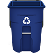

# &nbsp; [Recycling Reminder](http://alexa.amazon.com/#skills/amzn1.echo-sdk-ams.app.d1ed2ebe-4bc5-4df2-bf57-5b0a741b91c8)
 9

To use the Recycling Reminder skill, try saying...

* *Alexa, ask recycling reminder to remember my recycling week as this week*

* *Alexa, ask recycling reminder when my recycling is picked up*

* *Alexa, ask recycling reminder if recycling pickup is this week*

Never have to judge if it's your recycling week by looking down the street.  Configure Recycling Reminder to remember your biweekly pickup week by saying, "Alexa, ask Recycling Reminder to remember my recycling week as" followed by "this week" or "next week".  To use Recycling Reminder, ask Alexa to "ask Recycling Reminder if pickup is this week" to have a quick reminder or simply, "open Recycling Reminder".

***

### Skill Details

* **Invocation Name:** recycling reminder
* **Category:** null
* **ID:** amzn1.echo-sdk-ams.app.d1ed2ebe-4bc5-4df2-bf57-5b0a741b91c8
* **ASIN:** B01HPJ6M4G
* **Author:** Casey Loren Billman
* **Release Date:** July 29, 2016 @ 07:26:30
* **In-App Purchasing:** No
