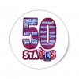

# &nbsp; [State Abbreviations](http://alexa.amazon.com/#skills/amzn1.echo-sdk-ams.app.77eb3611-3810-4b2c-b348-a5960e34ee14)
 0

To use the State Abbreviations skill, try saying...

* *Alexa, start State Abbreviations*

* *The answer is California*

* *My answer is Arizona*

Test your knowledge on the 50 US State abbreviations. The skill will quiz you on 5 different states. Alexa will ask you 5 randomized state abbreviations and you must guess the state name within 5 seconds.

How well do you know state abbreviations?

Alabama
Alaska
Arizona
Arkansas
California
Colorado
Connecticut
Delaware
Florida
Georgia
Hawaii
Idaho
Illinois
Indiana
Iowa
Kansas
Kentucky
Louisiana
Maine
Maryland
Massachusetts
Michigan
Minnesota
Mississippi
Missouri
Montana
Nebraska
Nevada
New Hampshire
New Jersey
New Mexico
New York
North Carolina
North Dakota
Ohio
Oklahoma
Oregon
Pennsylvania
Rhode Island
South Carolina
South Dakota
Tennessee
Texas
Utah
Vermont
Virginia
Washington
West Virginia
Wisconsin
Wyoming

***

### Skill Details

* **Invocation Name:** state abbreviations
* **Category:** null
* **ID:** amzn1.echo-sdk-ams.app.77eb3611-3810-4b2c-b348-a5960e34ee14
* **ASIN:** B01HT4NWF4
* **Author:** Sary Brave
* **Release Date:** July 4, 2016 @ 03:27:40
* **In-App Purchasing:** No
