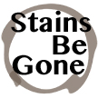

# &nbsp; [Stains Be Gone](http://alexa.amazon.com/#skills/amzn1.echo-sdk-ams.app.10f2107b-5fbf-4a8f-8132-4442bb1eb832)
 0

To use the Stains Be Gone skill, try saying...

* *Alexa, ask Stains Be Gone how do I clean coffee stains?*

* *Alexa, ask Stains Be Gone how to remove wine stains*

* *Alexa, ask Stains Be Gone how are egg stains cleaned?*

Stains Be Gone will help you get quick answers when life's spill happen. Ask Alexa how to various clean stains and you will be given prompt instructions, which means quicker clean up and less mess for you!

***

### Skill Details

* **Invocation Name:** stains be gone
* **Category:** null
* **ID:** amzn1.echo-sdk-ams.app.10f2107b-5fbf-4a8f-8132-4442bb1eb832
* **ASIN:** B01HUAE1NY
* **Author:** SYF
* **Release Date:** July 5, 2016 @ 04:27:40
* **In-App Purchasing:** No
